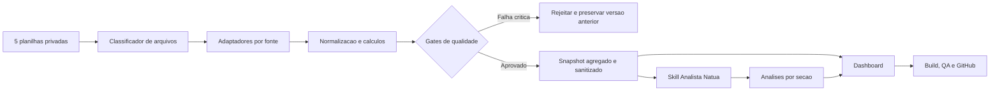

# Arquitetura do Dashboard Natua

## Principio

O sistema possui dois cerebros com responsabilidades diferentes:

1. **Motor de dados deterministico:** le planilhas, normaliza campos, calcula formulas, reconcilia fontes e decide se a publicacao e segura.
2. **Skill de analise:** recebe apenas o snapshot validado, explica sinais, prioridades, riscos e proximas decisoes.

Uma IA nunca substitui o motor de dados. Isso elimina variacao de calculo entre fornecedores e impede que uma resposta convincente seja confundida com um dado auditado.

## Componentes

| Componente | Responsabilidade | Pode conter PII? |
|---|---|---:|
| Upload temporario | Receber os cinco arquivos em memoria ou pasta privada | Sim, temporariamente |
| Adaptadores | Identificar abas e extrair somente campos necessarios | Sim, durante o processamento |
| Validador | Conferir schemas, periodos, formulas e reconciliacoes | Nao na saida |
| Snapshot | Guardar somente agregados, fontes e alertas | Nao |
| Skill do analista | Produzir interpretacao e plano de acao | Nao |
| Dashboard publico | Renderizar snapshot e analises aprovadas | Nao |
| Historico privado | Registrar importacoes, hashes, gates e rollback | Nao |

## Fronteiras de seguranca

- Os arquivos brutos existem apenas durante a importacao local/privada.
- O snapshot publico nao inclui linhas, nomes, telefones, e-mails, observacoes ou identificadores de paciente.
- O relatorio de erro usa contagens e nomes de campos, nunca valores das celulas.
- O publicador aceita somente arquivos explicitamente permitidos.

## Publicacao transacional

Cada importacao recebe um `importId`. O motor gera uma versao candidata, valida, grava o historico privado e apenas entao troca o snapshot ativo. Se qualquer gate critico falhar, a troca nao acontece. O rollback apenas reponta o snapshot ativo para uma versao aprovada anterior.

## Portabilidade entre IAs

Todas as IAs usam os mesmos artefatos:

- `AGENTS.md`: regras operacionais.
- `docs/contrato-de-dados.md`: semantica e formulas.
- `skills/natua-data-analyst/SKILL.md`: metodo de analise.
- `DashboardSnapshot`: unica entrada permitida para analise.
- `AnalysisPackage`: unica saida permitida da etapa de analise.

