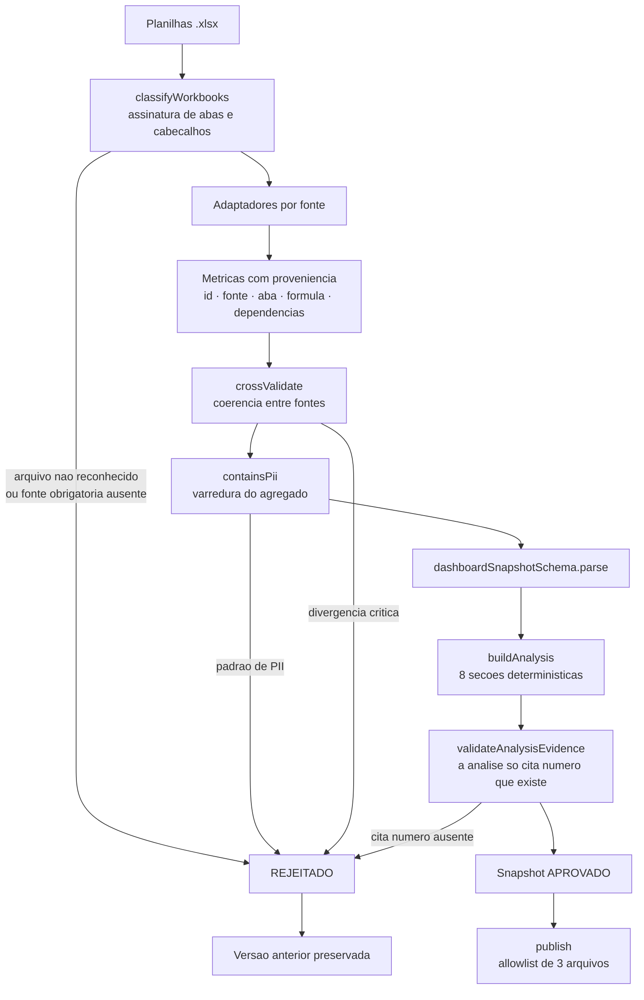

# Fluxo de importacao

Como uma planilha vira numero na tela, e onde o processo para quando algo esta errado.



## Passo a passo

1. **Classificacao.** Cada arquivo e identificado por assinatura, nunca por nome.
   As 5 fontes obrigatorias precisam estar presentes; a `weekly` e opcional.
2. **Adaptacao.** Um adaptador por fonte extrai, normaliza e calcula. Toda metrica
   nasce com `source`, `sheet`, `formula` e `dependencies`.
3. **Validacao cruzada.** Atendimentos do consolidado de marketing contra a Closer;
   competencia do financeiro contra o painel; atendimentos da semanal contra o mes.
4. **Gate de PII.** Varredura do agregado inteiro por padrao de e-mail, telefone e
   nome de campo proibido.
5. **Schema.** `zod` valida forma, tipos, unidades e o formato do periodo.
6. **Analise.** 8 secoes deterministicas, uma por tela. Cada afirmacao referencia
   IDs de metrica; citar numero que nao existe no snapshot **rejeita a importacao**.
7. **Publicacao.** Apenas tres arquivos podem ser escritos:
   `dashboard-snapshot.json`, `dashboard-snapshot.js`, `analysis-package.json`.

## O que bloqueia a publicacao

Severidade `CRITICAL` rejeita a importacao inteira e preserva a versao anterior:

- fonte obrigatoria ausente ou arquivo nao reconhecido;
- dois arquivos classificados no mesmo papel;
- aba ou cabecalho obrigatorio que desapareceu;
- metrica obrigatoria nao numerica ou negativa sem permissao;
- reconciliacao fora da tolerancia documentada;
- padrao de PII no snapshot ou na analise;
- periodo principal indeterminavel;
- formula com denominador zero sem marcar `SEM_BASE`;
- analise citando numero ausente do snapshot;
- planilha semanal que nao fecha com o proprio bloco de totais (13 baterias);
- semanal sem coluna `NOME` ou `VALOR`, ou sem nenhuma linha de paciente.

## O que publica com ressalva

Severidade `WARNING` aparece na tela de qualidade de dados e **nao** bloqueia:

| Codigo | O que significa |
|---|---|
| `CLOSER_STATUS_MISSING` | atendimento sem status decisorio; segue no denominador |
| `APPOINTMENT_CONFIRMATION_UNSUPPORTED` | sem regra auditavel de confirmacao; comparecimento fica `SEM_BASE` |
| `APPOINTMENT_OWNER_MISSING` | agendamento sem responsavel |
| `FINANCE_PERIOD_STALE` | competencia financeira defasada do painel |
| `WEEKLY_CHANNEL_UNMAPPED` | canal fora da taxonomia; sai dos recortes por canal |
| `WEEKLY_CATEGORY_REVENUE_ABSENT` | categoria sem coluna de receita; fica `SEM_BASE` |
| `WEEKLY_PIVOT_ABSENT` | semanal sem bloco de totais; reconciliacao nao executada |
| `WEEKLY_EXCEEDS_CLOSER` | semanal com mais atendimentos que o mes; conferir o recorte |

## Comandos

```bash
npm run dashboard:update:check -- /caminho/das/planilhas
```

Processa e mostra o resultado **sem escrever nada**. E o passo que responde
"o que muda se eu publicar isto?".

```bash
npm run dashboard:update -- /caminho/das/planilhas
```

Processa e grava os tres artefatos localmente.

```bash
npm run dashboard:update -- /caminho/das/planilhas --publish
```

Grava, roda `lint`, testes e build, e so entao publica no Git.

```bash
npm run dashboard:rollback
```

Restaura a versao anterior.

## Interface de upload

`server.ts` expoe o envio pela propria pagina, com processamento no backend.
A **tela de previa com mapeamento, impacto estimado nos KPIs e escolha entre
cancelar / corrigir mapeamento / publicar com avisos / substituir / restaurar**
(brief §4.2 e §5) esta **NAO EXECUTADO**. Hoje a previa existe pela CLI
(`dashboard:update:check`), nao pela interface.

A pagina **"Historico de importacoes"** (brief §5) tambem esta **NAO EXECUTADO**.
O versionamento existe em `store.ts` e o rollback funciona pela CLI; falta a tela.
